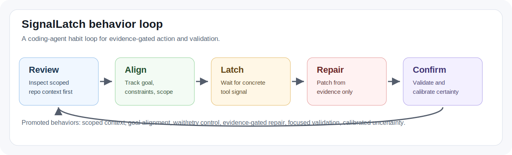
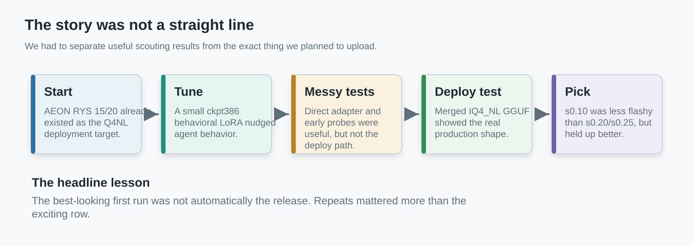
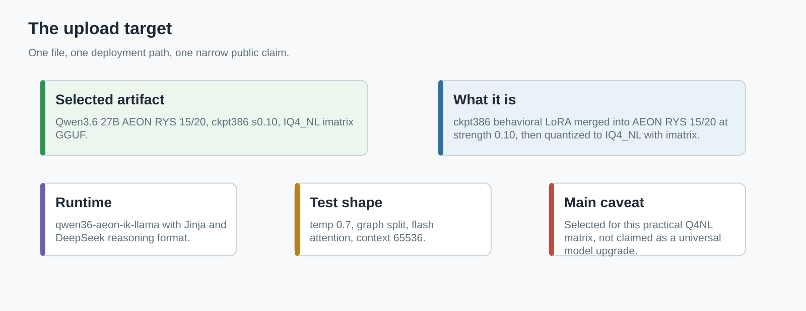
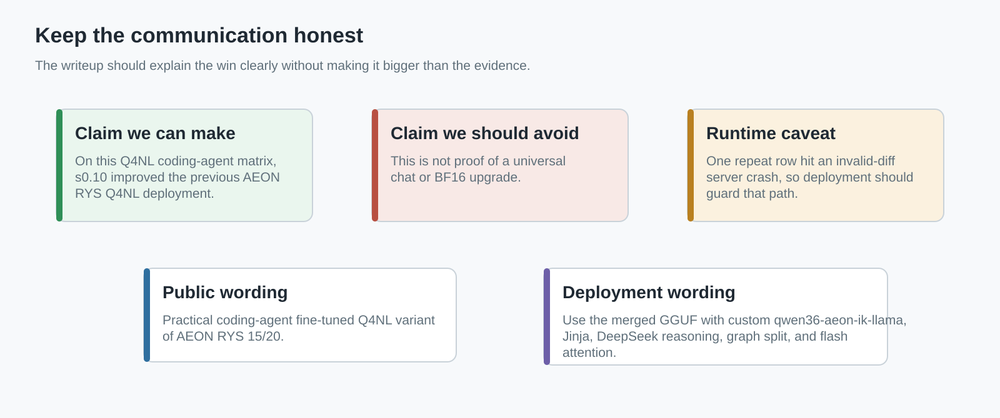
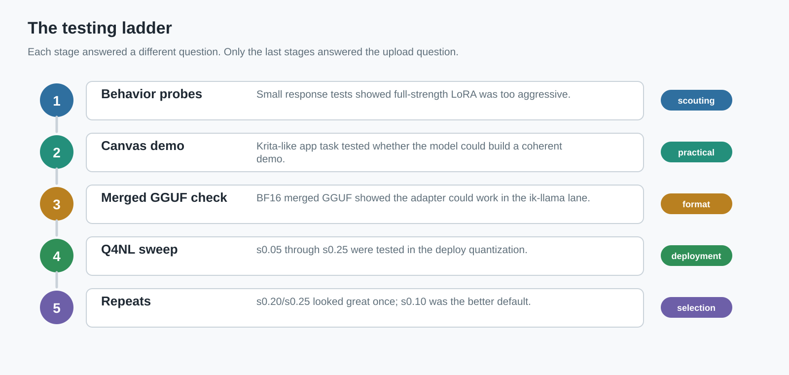
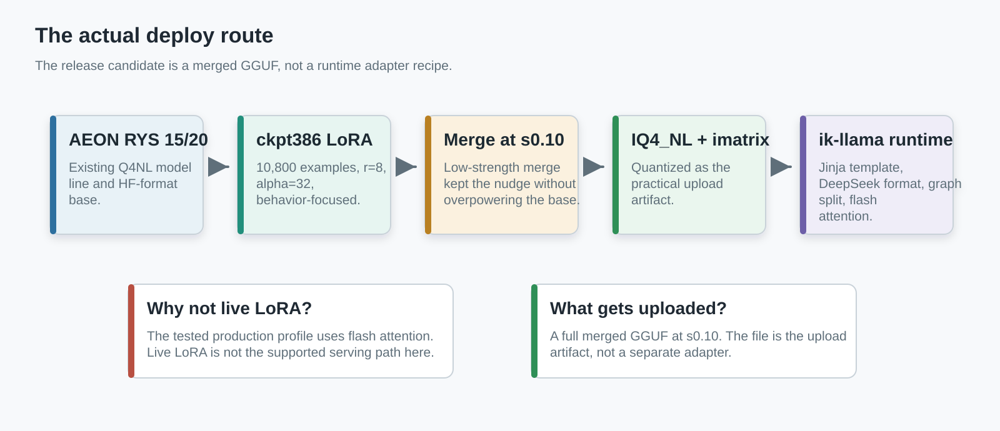
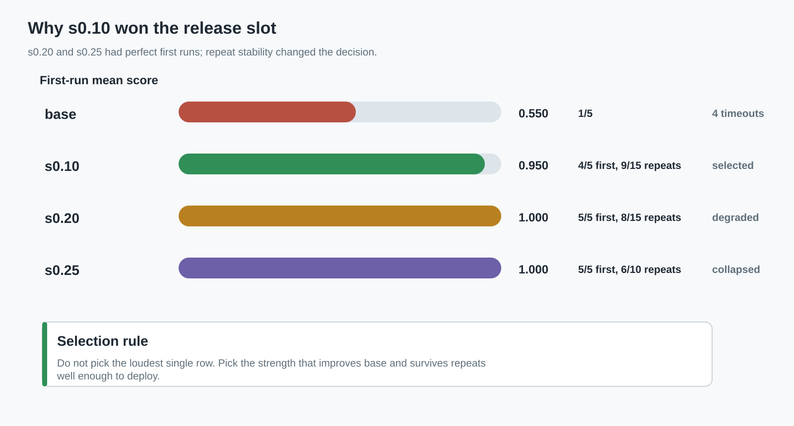
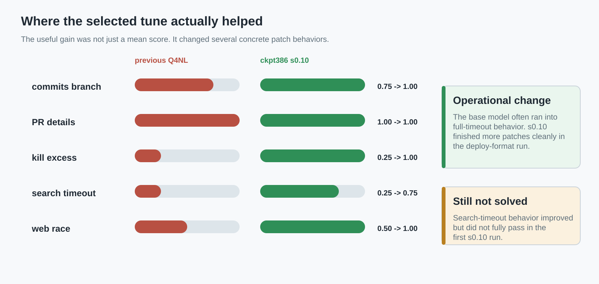
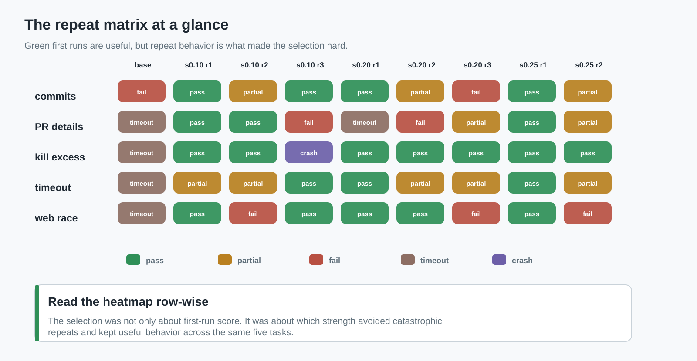

# Qwen3.6 AEON RYS SignalLatch ckpt386 s0.10: What We Actually Did

This is the longer, more casual write-up for the fine-tuned AEON RYS upload candidate.

The clean model card should stay short. This document is for the full story: what we trained, how we tested it, why the early results were confusing, why we stopped trusting the exciting single-run scores, and why the upload candidate ended up being the lower-strength `s0.10` merged `IQ4_NL` GGUF.

Related public guide:
- `https://github.com/noonr48/qwen36-aeon-ik-llama/tree/main/docs/rys-layer-duplication-guide`

Related release line:
- previous AEON RYS 15/20 Q4NL release: `jackasda211233/Qwen3.6-27B-AEON-RYS-15-20-GGUF`
- previous Q4NL file: `Qwen3.6-27B-AEON-RYS-MaxThinkCoder-IQ4_NL-ik-llama-custom-mixed.gguf`
- new upload candidate: `Qwen3.6-27B-AEON-RYS-SignalLatch-ckpt386-s010-IQ4_NL-imatrix.gguf`

## Visual map

SignalLatch is the public name for the behavior tune. The training data is best summarized as a coding-agent loop:



The whole process is easier to understand as a funnel: early tests told us whether the LoRA had any useful behavior, but only the final merged `IQ4_NL` runs answered the upload question.



The selected artifact is one merged GGUF file, not a live adapter recipe:



## Glossary

- `AEON`: the upstream/source model family this RYS line was built from.
- `RYS 15/20`: the AEON RYS variant made by duplicating/inserting the layer window `15..19`; this is the existing model line being upgraded here.
- `ckpt386`: the final behavioral LoRA checkpoint from the one-epoch run.
- `s0.10`: the merge strength used when blending the LoRA into the base model.
- `IQ4_NL` / `Q4NL`: the quantized GGUF deployment format we actually plan to upload and run.
- `imatrix`: importance-matrix-assisted quantization data used for the GGUF export.
- `ik-llama`: the custom runtime fork used for this model line.
- `graph split`: the tested multi-GPU split mode.
- `DeepSeek reasoning format`: the server-side reasoning-format setting used with the Jinja chat template.

## The short version

We started with the AEON RYS 15/20 model line and trained a small behavioral LoRA on top of it. The point was not to create a new general chat model. The point was to see whether a light behavior tune could make the existing RYS model behave better as a coding agent: finish patches, follow repo-specific instructions, handle tool-shaped context, avoid bad process behavior, and stop drifting into long stalled runs.

The model that looked best after the full deploy-format testing was:

```text
Qwen3.6-27B-AEON-RYS-SignalLatch-ckpt386-s010-IQ4_NL-imatrix.gguf
```

That means:
- base: `Qwen3.6-27B-AEON-RYS-15-20`
- adapter: behavioral LoRA checkpoint `386`
- merge strength: `0.10`
- deploy format: `IQ4_NL` GGUF with imatrix
- runtime: custom AEON ik-llama fork

The awkward part is that `s0.10` was not the most exciting single run. `s0.20` and `s0.25` both produced perfect `5/5` first runs. But those stronger settings did not hold up as well when we repeated the matrix. The lower-strength `s0.10` result was the more defensible default because it improved the base Q4NL deployment without the same collapse on repeat.

## What this was meant to upgrade

The upload candidate is meant as an upgrade over the existing AEON RYS 15/20 Q4NL deployment:

```text
Qwen3.6-27B-AEON-RYS-MaxThinkCoder-IQ4_NL-ik-llama-custom-mixed.gguf
```

That model already came from the RYS 15/20 layer-duplication line. The new work here was not another RYS surgery pass. The new work was a behavior fine-tune layered on top of the existing AEON RYS 15/20 base, then merged and quantized into the same practical Q4-class deployment lane.

So the public framing should be narrow:

> This is a practical coding-agent / tool-use-oriented fine-tuned Q4NL variant of the AEON RYS 15/20 release.

It should not be framed as:
- a universal upgrade over base in every format
- a general chat benchmark win
- a stock `llama.cpp` model
- a live-LoRA deployment recipe



## The training piece

The adapter was trained against the AEON RYS 15/20 HF-format base:

```text
/home/benbi/qwen36_rys_work/aeon_rys_15_20
```

Training data:

```text
/home/benbi/qwen36_ms_swift_lora/data/qwen36_behavioral_ms_swift_train.jsonl
```

Data shape:
- `10,800` examples
- about `18M` on disk

Final adapter:

```text
/home/benbi/qwen36_ms_swift_lora/output/train_hf_zero3_5060ti_5090_mb2_full_s35_resume200_rank4_5090_adamw_torch_fused_len640_r8_20260501_152142/checkpoint-386
```

Training completion:
- `global_step=386`
- `epoch=1.0`
- `max_steps=386`

LoRA config:
- PEFT type: `LORA`
- rank: `r=8`
- alpha: `32`
- dropout: `0.05`
- bias: `none`
- task type: `CAUSAL_LM`
- target modules: `q_proj`, `k_proj`, `v_proj`, `o_proj`, `gate_proj`, `up_proj`, `down_proj`, `out_proj`, `in_proj_qkv`, `in_proj_a`, `in_proj_b`, `in_proj_z`

The important practical point is that the adapter was small and behavior-focused. It was not trained to teach broad new knowledge. It was trained to nudge agent behavior.

## The first trap: early tests were not the deployment path

The first wave of testing was useful, but also misleading if read too literally.

We tested checkpoints and strengths through a mix of direct adapter paths, small behavior probes, and a canvas-demo task. That helped answer basic questions:
- Did the LoRA do anything at all?
- Were full-strength adapters too aggressive?
- Were checkpoint `350` and `386` better candidates than earlier checkpoints?
- Could the model follow a practical app-building request instead of only answering synthetic probes?



The answers were messy.

In the early behavioral checkpoint eval, the base looked stronger than the raw checkpoints in several small response-style probes:

| Candidate | Mean | Read |
|---|---:|---|
| base | `0.6333` | strongest in that early probe format |
| ckpt245 | `0.1167` | weak |
| ckpt280 | `0.1667` | weak |
| ckpt300 | `0.1250` | weak |
| ckpt350 | `0.1667` | weak |
| ckpt385 | `0.2083` | weak |
| ckpt386 | `0.2417` | weak but best checkpoint in that group |

That looked bad at first, but the setup was not the thing we were actually going to deploy. It was a scouting lane. The direct/PEFT path and the chat/reasoning formatting were still not aligned with the final ik-llama serving path.

The strength sweep then showed the next useful pattern: lower strengths were much saner than full strength.

| Candidate | Mean | Min | Avg output tokens | Read |
|---|---:|---:|---:|---|
| ckpt350 `s0.25` | `0.7000` | `0.5000` | `406.8` | best early behavior sweep point |
| ckpt386 `s0.25` | `0.6375` | `0.2500` | `406.8` | close second |
| ckpt350 `s0.50` | `0.4750` | `0.2500` | `132.5` | weaker |
| ckpt386 `s0.50` | `0.4750` | `0.2500` | `134.8` | weaker |
| ckpt350 `s0.75` | `0.1750` | `0.0000` | `87.8` | too strong |
| ckpt386 `s0.75` | `0.1750` | `0.0000` | `72.5` | too strong |
| ckpt350 `s1.00` | `0.1250` | `0.0000` | `74.2` | too strong |
| ckpt386 `s1.00` | `0.1750` | `0.0000` | `74.5` | too strong |

That is why we stopped thinking about full-strength LoRA as the deployment path. It was not subtle. Higher strength made the model shorter, more brittle, and less useful on the actual behavior probes.

## The canvas test

The first practical test was an isolated canvas app prompt. The user-facing task was basically:

> Build a small isolated canvas tool, somewhat Krita-like, with layers, brushes, some transformation tools, and an AI image generation hook. The hook does not need to actually work because Sloane is not on that system. This is a demo and a practical test.

This was a good early test because it required the model to plan and produce a small coherent app shape rather than just answer a single question. It also exposed whether the model got stuck, forgot the requested feature set, or created only a thin shell.

The first exhaustive canvas run looked bad:

| Group | Result |
|---|---|
| many checkpoint/strength combos | `0.625`, timeout, not passing |
| full-strength variants | often `0.0417`, not useful |
| base rerun in one matrix | `0.0417`, timeout |

The mistake would have been to conclude "the LoRA cannot do it." The more accurate read was: the direct adapter/runtime path was not stable enough, and the chat/reasoning setup still needed fixing.

After the no-think/direct-adapter chat fix, the canvas matrix improved:

| Variant | Score | Pass | Read |
|---|---:|---|---|
| ckpt350 `s0.25` direct adapter | `1.0000` | yes | best direct-adapter canvas point |
| ckpt386 `s0.25` direct adapter | `0.7500` | no | partial |
| ckpt386 `s0.50` direct adapter | `0.7500` | no | partial |
| ckpt350 `s1.00` direct adapter | `0.6250` | no | too strong |
| ckpt350 `s0.50` direct adapter | `0.0417` | no | failed |
| ckpt386 `s1.00` direct adapter | `0.0417` | no | failed |

Then the merged GGUF canvas result changed the read again:

| Variant | Format | Score | Pass | Read |
|---|---|---:|---|---|
| ckpt350 `s0.25` | merged BF16 GGUF | `0.9167` | yes | passed, minor layer-model miss |
| ckpt386 `s0.25` | merged BF16 GGUF | `1.0000` | yes | full pass |

That result mattered. It showed the LoRA could help when merged into the model and served through the ik-llama GGUF path. The earlier negative result applied more to the live/direct adapter path than to the final deployment shape.

## Why the final testing moved to merged IQ4_NL

At this point the key question changed.

We were not trying to pick the best theoretical adapter in BF16. We were trying to pick the thing we would actually deploy.



The deploy target was:
- GGUF
- `IQ4_NL`
- imatrix quantized
- custom AEON ik-llama runtime
- Jinja template
- DeepSeek reasoning format
- graph split
- flash attention
- temp `0.7`
- context `65536`

Live LoRA loading was not the right production path for this release because the tested serving profile uses flash attention, and the runtime path rejects live LoRA with flash attention. So the long-term path became:

> merge the adapter into the model first, then export and quantize a full GGUF.

That is why the final upload candidate is a merged GGUF file, not an adapter file.

## The deploy-format Q4NL sweep

We exported multiple `IQ4_NL` GGUF files for checkpoint `386` at smaller merge strengths:

| File strength | Artifact |
|---|---|
| `s0.05` | `Qwen3.6-27B-AEON-RYS-15-20-ckpt386-s005-IQ4_NL-imatrix.gguf` |
| `s0.075` | `Qwen3.6-27B-AEON-RYS-15-20-ckpt386-s0075-IQ4_NL-imatrix.gguf` |
| `s0.10` | `Qwen3.6-27B-AEON-RYS-SignalLatch-ckpt386-s010-IQ4_NL-imatrix.gguf` |
| `s0.125` | `Qwen3.6-27B-AEON-RYS-15-20-ckpt386-s0125-IQ4_NL-imatrix.gguf` |
| `s0.15` | `Qwen3.6-27B-AEON-RYS-15-20-ckpt386-s015-IQ4_NL-imatrix.gguf` |
| `s0.20` | `Qwen3.6-27B-AEON-RYS-15-20-ckpt386-s020-IQ4_NL-imatrix.gguf` |
| `s0.25` | `Qwen3.6-27B-AEON-RYS-15-20-ckpt386-s025-IQ4_NL-imatrix.gguf` |

Each file was `16,554,833,600` bytes on disk.

Tested server shape:

```bash
./build/bin/llama-server \
  -m /path/to/Qwen3.6-27B-AEON-RYS-SignalLatch-ckpt386-s010-IQ4_NL-imatrix.gguf \
  -c 65536 \
  -ngl 999 \
  -np 1 \
  -fa on \
  -sm graph \
  --temp 0.7 \
  --jinja \
  --reasoning-format deepseek \
  --reasoning-budget 0 \
  -cram 0 \
  --ctx-checkpoints 0
```

The matrix used five practical code-agent patch tasks:

| Task | What it tested |
|---|---|
| `github_mcp_commits_fix_repeat` | branch handling, schema update, request parameter use, docs mention, build |
| `github_mcp_pr_details_fix` | using the PR detail endpoint instead of list fields for additions/deletions/changed files |
| `local_search_kill_excess_fix` | targeted process cleanup instead of broad kill behavior |
| `local_search_search_timeout_fix` | carrying timeout through schema, handler, and backend call |
| `local_search_web_search_race_fix` | first-success race behavior instead of waiting for all engines |

This was not a benchmark leaderboard. It was a practical production matrix: can the model make the actual patch we want, in a repo-shaped environment, with verifier checks afterwards?

## Methods and scope
- scoring: task verifiers assigned fractional scores from `0.0` to `1.0`
- strict pass: a task only counted as pass when the verifier marked `pass=True`
- timeout-like: a task was flagged when the run hit the configured task timeout or behaved like a full stalled run
- repeat logic: first-run results were not enough for selection; finalist strengths were rerun on the same five-task matrix
- runtime scope: results here refer to the merged `IQ4_NL` GGUF deployment path, not live LoRA serving and not BF16 general evaluation
- public caveat: selected summaries are mirrored in `evidence/`; raw training and conversion paths remain build-machine provenance

## Base Q4NL versus the fine-tuned Q4NL candidates

The base Q4NL result was weak in this matrix:

| Candidate | Pass | Mean | Elapsed | Timeout-like tasks | Read |
|---|---:|---:|---:|---:|---|
| previous AEON RYS Q4NL | `1/5` | `0.550` | `2660s` | `4` | weak baseline for this practical matrix |

It did have partial competence. For example, it passed the PR detail verifier, but that run still hit the full `600s` timeout. The bigger issue was control. It repeatedly produced full-timeout runs and missed process/race/timeout behavior.

The first deploy-format sweep looked like this:

| Candidate | Pass | Mean | Elapsed | Timeout-ish | Read |
|---|---:|---:|---:|---:|---|
| base Q4NL | `1/5` | `0.550` | `2660s` | `4` | weak baseline |
| `s0.05` | `2/5` | `0.600` | `2418s` | `3` | still weak |
| `s0.075` | `3/5` | `0.900` | `1638s` | `0` | strong but missed web-race and kill-excess patterns |
| `s0.10` | `4/5` | `0.950` | `1106s` | `0` | best stable-looking first run |
| `s0.125` | `2/5` | `0.775` | `1190s` | `0` | weaker |
| `s0.15` | `3/5` | `0.875` | `1186s` | `0` | decent, not best |
| `s0.20` | `5/5` | `1.000` | `1568s` | `1` | perfect score but one full PR-details timeout |
| `s0.25` first | `5/5` | `1.000` | `1328s` | `0` | perfect first score |
| `s0.25` repeat | `1/5` | `0.750` | `1343s` | `0` | did not reproduce |

That table is the whole story in miniature. The LoRA clearly did something useful in the Q4NL deployment format. But the obvious winner after one run was not the same as the defensible upload default.



## What improved at s0.10

The cleanest public comparison is previous AEON RYS Q4NL against the selected `s0.10` upload candidate:



| Task | Previous AEON RYS Q4NL | ckpt386 `s0.10` IQ4_NL | Read |
|---|---:|---:|---|
| commits branch fix | `0.75` fail | `1.00` pass | fixed branch/schema/request behavior |
| PR details fix | `1.00` pass, `600s` timeout | `1.00` pass, `271s` | both passed, fine-tune was much cleaner |
| kill excess process fix | `0.25` fail, `600s` timeout | `1.00` pass | large improvement |
| search timeout fix | `0.25` fail, `600s` timeout | `0.75` fail | partial improvement |
| web search race fix | `0.50` fail, `600s` timeout | `1.00` pass | large improvement |

The `s0.10` first run was:
- strict pass: `4/5`
- mean score: `0.950`
- elapsed: `1106s`
- timeout-like tasks: `0`

The base first run was:
- strict pass: `1/5`
- mean score: `0.550`
- elapsed: `2660s`
- timeout-like tasks: `4`

This is the practical reason for publishing this candidate. The fine-tune did not just move a small score. It changed the operational shape of the run: fewer stalls, more finished patches, and better behavior on the concrete tool/repo tasks we cared about.

## Why we did not choose s0.20 or s0.25

After the first sweep, it was tempting to choose `s0.20` or `s0.25`.

They both hit `5/5` in isolated first runs. That is exactly the kind of result that can fool you if you stop early.

So we repeated the finalist strengths.



Final repeat comparison:

| Candidate | Runs | Strict pass | Strict mean | Read |
|---|---:|---:|---:|---|
| `s0.10` | `3` | `9/15` | `0.842` | best default candidate |
| `s0.10` crash-adjusted | `3` | `9/14` | `0.884` | excludes one invalid server-crash task |
| `s0.20` | `3` | `8/15` | `0.850` | degraded across repeats despite perfect first run |
| `s0.25` | `2` | `6/10` | `0.875` | first 5/5 collapsed to 1/5 on repeat |

The `s0.25` story was the warning sign:
- first run: `5/5`, mean `1.000`
- repeat: `1/5`, mean `0.750`

That is not stable enough to call a default for this deployment path.

The `s0.20` story was subtler:
- first run: `5/5`, mean `1.000`
- repeat2: `2/5`, mean `0.825`
- repeat3: `1/5`, mean `0.725`

It kept missing PR-detail and timeout behavior after the perfect first run. That made it a bad default even though the first row looked beautiful.

The `s0.10` story was less flashy but more deployable:
- first run: `4/5`, mean `0.950`
- repeat2: `2/5`, mean `0.825`
- repeat3 strict: `3/5`, mean `0.750`
- repeat3 had one invalid runtime/server-crash row, so the adjusted read is better than the strict row suggests

The final decision was not "s0.10 is solved." The decision was:

> If we need to deploy this now, `s0.10` is the least misleading default.

## The runtime caveat

One `s0.10` repeat3 row was not a normal model failure.

The `local_search_kill_excess_fix` task scored `0.25`, but the Claw side failed immediately after API retries. The server log showed:

```text
std::runtime_error
Invalid diff
```

That happened during/after the previous web-race task. We treated this as likely a runtime stability incident, not a normal patch attempt from the model. Strict scoring still counts it, because the run failed, but model-selection notes should keep the distinction.

This is one reason the final language should stay careful:
- the LoRA improved the Q4NL practical matrix
- the selected artifact is a good current upload candidate
- the runtime still needs guarding before long sustained production service

## What the testing says and does not say

What the testing does say:
- The merged Q4NL LoRA path scored higher than previous AEON RYS Q4NL on our five-task practical matrix.
- The useful strength is low. Full strength was too aggressive.
- The merged GGUF path is the right path to judge for deployment.
- `s0.10` is the selected default among the tested strengths because it balances improvement and repeat stability.

What the testing does not say:
- It does not prove the fine-tune is better for all tasks.
- It does not prove the fine-tune is better in BF16.
- It does not prove `s0.10` is globally optimal.
- It does not make this a stock `llama.cpp` release.
- It does not make live LoRA loading the recommended serving setup.

The most accurate public sentence is:

> On our practical Q4NL coding-agent matrix, the selected ckpt386 `s0.10` merged GGUF improved the previous AEON RYS Q4NL baseline from `1/5`, mean `0.550`, to `4/5`, mean `0.950` on the first deploy-format run, and was the most defensible upload default after the repeat runs we performed.

## Selected artifact

Selected file:

```text
Qwen3.6-27B-AEON-RYS-SignalLatch-ckpt386-s010-IQ4_NL-imatrix.gguf
```

Companion source-quality merged file:

```text
Qwen3.6-27B-AEON-RYS-SignalLatch-ckpt386-s010-BF16.gguf
```

Artifact directory:

```text
/home/benbi/qwen36_ms_swift_lora/evals/q4nl_strength_sweep_20260505/gguf_iq4nl
```

Size:

```text
IQ4_NL: 16,554,833,600 bytes
BF16:   57,597,296,000 bytes
```

Recommended runtime:

```text
https://github.com/noonr48/qwen36-aeon-ik-llama
```

Recommended serving flags:

```bash
./build/bin/llama-server \
  -m /path/to/Qwen3.6-27B-AEON-RYS-SignalLatch-ckpt386-s010-IQ4_NL-imatrix.gguf \
  -c 65536 \
  -ngl 999 \
  -np 1 \
  -fa on \
  -sm graph \
  --temp 0.7 \
  --jinja \
  --reasoning-format deepseek \
  --reasoning-budget 0 \
  -cram 0 \
  --ctx-checkpoints 0
```

## Evidence bundle

The selected run summaries are bundled under [`evidence/`](evidence/README.md) so the checked-in guide does not depend only on inaccessible build-machine paths.

Main notes:
- [running_notes.md](evidence/running_notes.md)

Q4NL deploy matrix:
- [base_q4nl_summary.md](evidence/base_q4nl_summary.md)
- [s010_first_summary.md](evidence/s010_first_summary.md)
- [s010_repeat2_summary.md](evidence/s010_repeat2_summary.md)
- [s010_repeat3_summary.md](evidence/s010_repeat3_summary.md)
- [s020_first_summary.md](evidence/s020_first_summary.md)
- [s020_repeat2_summary.md](evidence/s020_repeat2_summary.md)
- [s020_repeat3_summary.md](evidence/s020_repeat3_summary.md)
- [s025_first_summary.md](evidence/s025_first_summary.md)
- [s025_repeat2_summary.md](evidence/s025_repeat2_summary.md)

Earlier scouting and practical tests:
- [canvas_exhaustive_summary.md](evidence/canvas_exhaustive_summary.md)
- [canvas_direct_adapter_summary.md](evidence/canvas_direct_adapter_summary.md)
- [canvas_merged_gguf_summary.md](evidence/canvas_merged_gguf_summary.md)
- [prod_matrix_20260503_summary.md](evidence/prod_matrix_20260503_summary.md)

The training adapter and full local conversion artifacts remain build-machine provenance rather than public documentation:

```text
server:/home/benbi/qwen36_ms_swift_lora/output/train_hf_zero3_5060ti_5090_mb2_full_s35_resume200_rank4_5090_adamw_torch_fused_len640_r8_20260501_152142/checkpoint-386
server:/home/benbi/qwen36_ms_swift_lora/evals/q4nl_strength_sweep_20260505/gguf_iq4nl
```

## Final read

The model is not magic, and the testing was not clean in the way a polished benchmark table looks clean. It was a real engineering pass: try the adapter, notice the direct path is misleading, fix the chat/runtime setup, test the canvas demo, move to merged GGUF, test the exact Q4NL deployment shape, get fooled by one-run perfect scores, repeat the finalists, and pick the strength that holds up best.

That is why the release should be honest:

```text
ckpt386 s0.10 IQ4_NL is a practical upgrade candidate over the previous AEON RYS 15/20 Q4NL deployment for coding-agent/tool-use work. It is the selected default among the tested strengths, not a universal final answer.
```
