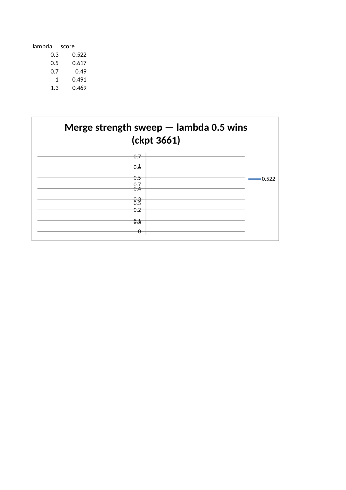
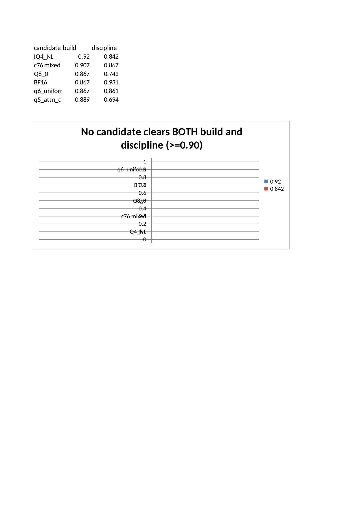
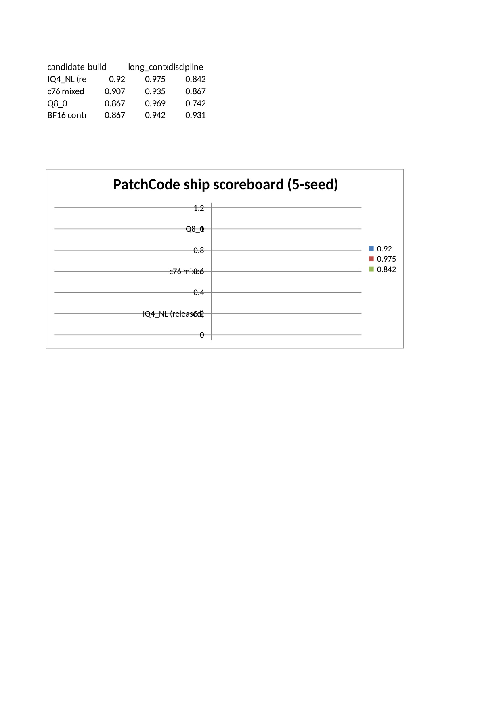

# Qwen3.6 AEON RYS PatchCode (merged_lam0.5): What We Actually Did

This is the longer, more casual write-up for the PatchCode upload candidate (internal project name `merged_lam0.5`).

The clean model card stays short. This document is the full story: what we distilled, exactly how the dataset was built, how we tested it, why the early single-run scores fooled us, why we stopped trusting them, and why the upload candidate ended up being the plain `IQ4_NL` (reasoning-imatrix) merged GGUF rather than a heavier mixed-quant recipe.

Related public guides:
- runtime fork: `https://github.com/noonr48/qwen36-aeon-ik-llama`
- RYS layer-duplication / architecture guide: `https://github.com/noonr48/qwen36-aeon-ik-llama/tree/main/docs/rys-layer-duplication-guide`
- previous fine-tuned release (SignalLatch): `https://huggingface.co/jackasda211233/Qwen3.6-27B-AEON-RYS-SignalLatch-GGUF`

Related release line:
- previous finetune: `Qwen3.6-27B-AEON-RYS-SignalLatch-ckpt386-s010-IQ4_NL.gguf`
- this upload candidate: `Qwen3.6-27B-AEON-RYS-Agentic-Coder-PatchCode.IQ4_NL.gguf`

## Glossary

- `AEON`: the upstream/source model family this RYS line was built from (`AEON-7/Qwen3.6-27B-AEON-Ultimate-Uncensored`).
- `SignalLatch` / `ckpt386-s010`: the previous finetune in this line — a behaviour LoRA (checkpoint 386) merged into the AEON RYS base at strength `0.10`. PatchCode is built on top of this.
- `PatchCode` / `merged_lam0.5`: the public name for this release. It is a second behaviour distil (an agentic-coder joint LoRA) merged onto SignalLatch at strength `0.5`.
- `IQ4_NL`: the quantized GGUF deployment format we actually upload and run.
- `imatrix`: importance-matrix-assisted quantization data. `reasoning-imatrix` = calibrated on reasoning/coding text (the kind that worked); `media-imatrix` = an earlier calibration kind that underperformed.
- `ik-llama`: the custom runtime fork. The `qwen3_5` hybrid architecture does not load on stock `llama.cpp` / `vLLM`.
- `KritaLite`: our hardened real-world discriminator build (a ~160k-token multi-file app, 15 binary verifier components). Single-shot coding gates saturate on this model family, so we stopped trusting them.
- `discipline` / `style_discipline`: a rubric measuring the distilled action-first style (no preamble, claim-requires-run, narrate→act→verify).

## The short version

We started from the SignalLatch finetune and distilled a second, agentic-coder behaviour LoRA on top of it. The goal was not a new general chat model. The goal was to make the model a better coding agent: action-first execution, claims backed by an actual run, systematic diagnose→fix loops, stable multi-turn tool use, and fewer stalled runs.

After a full 5-phase bake-off, the model that held up was:

```text
Qwen3.6-27B-AEON-RYS-Agentic-Coder-PatchCode.IQ4_NL.gguf
```

That means:
- base: `Qwen3.6-27B-AEON-RYS-SignalLatch-ckpt386-s010`
- adapter: agentic-coder joint LoRA, checkpoint `3661`
- merge strength: `0.5` (effective alpha/r = 1.0)
- deploy format: plain `IQ4_NL` with reasoning-imatrix
- runtime: custom AEON ik-llama fork

The awkward part — and the reason this write-up is long — is that the eventual ship pick was **not** the candidate that looked best early. A mixed-quant recipe (`c76`) hit a perfect-looking build score on the first multi-seed pass and did not reproduce. A 5-seed, same-condition confirm reversed the read. The plain `IQ4_NL` ended up tied with everything else within noise, so the decision fell to non-noise axes (size, recipe safety), where plain `IQ4_NL` wins.

## What this was meant to upgrade

PatchCode is an upgrade over the existing SignalLatch finetune:

```text
Qwen3.6-27B-AEON-RYS-SignalLatch-ckpt386-s010-IQ4_NL.gguf
```

The new work was not another RYS architecture pass (the architecture is unchanged and is documented in the layer-duplication guide). The new work was a behaviour distil layered on top of SignalLatch, then merged and quantized into the same practical Q4-class deployment lane.

Public framing stays narrow:

> This is a practical coding-agent / tool-use-oriented fine-tuned IQ4_NL variant of the SignalLatch release.

It should not be framed as:
- a universal upgrade over base in every format
- a general chat benchmark win
- a stock `llama.cpp` / `vLLM` model
- a live-LoRA deployment recipe

## The dataset — exact pipeline

This is the part most people ask about, so it is written out in full. The training blend is `~58.5k` examples and is made of two pieces: a large **synthetic coding-agent behaviour backbone** and a smaller **curated action-first style slice**, blended together.

### Piece 1 — synthetic coding-agent behaviour backbone (~43k)

A standalone generator (`generate_v2.py`) produces synthetic multi-turn coding-agent traces. It is **fully synthetic** — no real user data, no scraped repos. The pipeline:

1. **Behaviour-driven generation.** A pool of parallel workers calls a coding-agent teacher model. Each call is shaped around a named *behaviour* from a fixed behaviour pool (~30 behaviours), for example:
   - `survey_before_edit` — read/search the real context before touching code
   - `hypothesis_driven_debugging` — form a hypothesis, then verify
   - `tool_intent_first` — express tool intent before prose
   - `weigh_alternatives_then_commit` — weigh ≥3 options, commit to one, verify
   - `external_awareness` — check versions/docs before asserting
   - `recall_first_habit` — recall prior context before re-deriving
2. **Tool-agnostic vocabulary (anti-lock-in).** Tool calls use a behavioural-category vocabulary (e.g. `memory_search`, `repo_search`, `render_or_visual_proof`), not real tool names. This is deliberate: the model learns *when/why to use a tool*, not a specific vendor's API surface.
3. **Scenarios.** A synthetic scenario bank provides repo-shaped task context (file trees, failing tests, stack traces) so the traces are grounded in realistic edit/verify loops.
4. **Quality gates (per sample).** Traces that fail the gates are dropped, not emitted:
   - `no-op-edit` guard (a claimed edit that changes nothing)
   - `claim-without-verify` reject (the assistant claims done with no run/check)
   - `reasoning-empty` / `incomplete-trace` / `lang-runner-mismatch` / `prompt-over-cap`
5. **Deficit-resume scheduling.** Generation runs continuously, tracks per-behaviour deficits, and resumes after interruption until target counts are met. (~30 samples/sec on the build host.)

**Corpus assembly + filtering (exact counts):**
- raw unified coding corpus: `71,776` samples
- filter drops `10,666` bad samples → `61,110` kept
  - top drop reasons: `prompt_over_cap` 3,946 · `lang_runner_mismatch` 3,645 · `reasoning_empty` 2,086 · `incomplete_trace` 861 · `claim_without_verify` 620
- coding training subset used for the blend: `43,075` (`meda_lora_train_v2x1`)

The broader synthetic corpus spans five behaviour layers (media-behaviour 42,973 · tool-depth 15,242 · reliability 19,393 · self-correction 31,476 · coding 7,721 = `116,805` total before filtering); the blend draws the coding-oriented subset.

### Piece 2 — curated action-first style slice (~7k)

A smaller slice of curated execution-style traces that model the exact discipline we wanted to amplify: terse narrate→act→verify, no preamble, claim-requires-run. Composition (`6,953` total):
- own multi-project execution sessions (`5,455`) — span many different projects on purpose, so the style generalises instead of locking to one domain
- a different-domain contributor (`1,130`) — explicitly included for cross-project transfer
- reasoning-chain exemplars (`368`) — weigh-alternatives deliberation seeds

**De-identification / anti-lock-in pass:** real tool names, hostnames, absolute paths, and identifiers are abstracted to behavioural-category tokens / placeholders. The supervision is **assistant-turn-only** — system/user/tool turns (where real project content lives) are masked (`IGNORE_INDEX`), so the model learns a *behaviour policy conditioned on varied context*, not project facts as outputs.

### Piece 3 — the blend

A small blender oversamples the style slice so it is not drowned by the larger coding backbone, then shuffles:

- coding backbone: `43,075`
- style slice oversampled ~2.2×
- blended training file: `58,576` (`training_blend`) ≈ **~74% coding backbone / ~26% action-first style**

The oversample ratio was chosen so the style shows up without overfitting the smaller slice; a held-out task type was used to check it generalises rather than parrots.

### What the dataset is *not*

- It is not scraped real-user data or real private repos.
- It is not a single-topic dataset — both pieces deliberately span many projects/domains.
- It does not teach new domain *facts*; it teaches an execution *discipline*.

## The training piece

A single LoRA was joint-co-trained on the blended `58.5k` set (one adapter, not two-then-merge — a prior two-adapter λ-merge plan was superseded because post-hoc merges can kill a fragile capability with no usable λ).

Training config:
- PEFT type: `LORA`
- rank: `r=32`, alpha: `64` (alpha/r = 2.0)
- dropout: `0.05`
- target modules: **all-linear**, including the hybrid arch projections — `q/k/v/o_proj`, `gate/up/down_proj`, `out_proj`, and the linear-attn/SSM projections `in_proj_qkv / in_proj_a / in_proj_b / in_proj_z`
- supervision: completion-only (assistant turns only)
- optimiser: adamw, lr `5e-5` + warmup + cosine decay
- epochs: `1`
- backend: model-parallel `device_map` across a multi-GPU host (the max-quality path; the no-NVLink fleet ruled out DeepSpeed/FSDP here)

Completion:
- `global_step=3661` = `epoch 1.0` complete
- final `train_loss ≈ 0.853`
- runtime ~91h (~89.5 s/it), grad-norm steady (no divergence)
- 37 checkpoints saved across the run → full trajectory available for eval

The adapter was behaviour-focused and small. It was not trained to teach broad new knowledge.

## The merge — why λ=0.5

The trained default adapter strength (alpha/r = 2.0) was **over-applied**. A checkpoint × strength eval showed half-strength beat full-strength on all three tested checkpoints:

| checkpoint | λ=0.3 | λ=0.5 | λ=0.7 | λ=1.0 |
|---|---:|---:|---:|---:|
| 3661 | 0.522 | **0.617** | 0.490 | 0.491 |
| 2600 | 0.567 | **0.573** | — | 0.442 |
| 1800 | 0.540 | **0.564** | — | 0.397 |

At λ=1.0 the adapter was net-neutral-to-harmful (one checkpoint fell *below* the un-adapted base). The mechanism: an over-loud LoRA delta pushes activations into regimes that hurt calibrated behaviour (preamble returns, over-claiming). λ=0.5 (effective alpha/r = 1.0) keeps the style direction but respects base calibration. So the merge was done at **λ=0.5 onto SignalLatch (ckpt386-s010)**, then exported to BF16 GGUF. (A future v2 could bake the good strength in by training at alpha=r=32, removing the inference-time knob.)



## Why the final testing moved to merged IQ4_NL

The key question was not "best adapter in BF16" — it was "what we would actually deploy". The deploy target was a merged GGUF, `IQ4_NL`, imatrix-quantized, on the custom ik-llama runtime (Jinja + DeepSeek reasoning format + flash attention + graph split, temp `0.7`).

Live LoRA loading is not the production path for this release (the tested serving profile uses flash attention, which conflicts with live LoRA on this runtime). So the long-term path became: **merge the adapter first, then export + quantize a full GGUF.** That is why the upload is a merged GGUF, not an adapter.

The plain `IQ4_NL` uses the **reasoning/coding imatrix** (the kind that worked). An earlier build used a media-domain imatrix; it underperformed and was superseded.

## The testing ladder (5 phases + confirms)

Single-shot and hard-suite gates **saturate** on this model family (every quant scores ~the same, including BF16). The discrimination that actually changed the decision came from a 160k-token real-world build (KritaLite) run multi-seed, plus a discipline rubric, plus an autonomous-loop convergence test. The phases:

**Phase 1 — single-seed real-world build.** Made the plain `IQ4_NL` look like the winner (0.933 vs c76's 0.867). This was **noise** — it did not reproduce.

**Phase 2 — multi-seed KritaLite (3 seeds).** Reversed phase 1: `c76`/`c404`/`c373` hit 0.933; plain `IQ4_NL` dropped to 0.867. Now a mixed-quant recipe looked like the winner.

**Phase 3 — 40-recipe broad search.** Returned all-zero. Root cause was a **harness bug** (the eval script imports a `config.json` that was not copied into the eval root), not real scores.

**Phase 4 — search re-gate (bug fixed).** Re-scored all 53 candidates correctly. No new recipe beat the curated originals; the broad search does not help this merge.

**Phase 5 — discipline + agentic process.** Plain `IQ4_NL` and BF16 led the action-first *discipline* rubric (0.931); `c76` led *process efficiency* (fewest turns/tools/errors).

**Overnight 2 — base-precision × attention-promotion matrix (3 seeds).** Decomposed the build/discipline tradeoff. No candidate clears "both" (build ≥ 0.90 **and** discipline ≥ 0.90):
- promotion destroys discipline regardless of base precision
- uniform higher precision does **not** fix build (build is not precision-limited)

**Confirm — 5-seed, same-condition, baseline vs c76 head-to-head.** The decisive run:

| candidate | build (5-seed) | long-context | discipline (5-seed) | size |
|---|---:|---:|---:|---:|
| **plain IQ4_NL (reasoning imx)** | 0.920 (±0.067) | 0.975 | 0.842 (±0.333) | 16.6 G |
| c76 (promoted attn) | 0.907 (±0.067) | 0.935 | 0.867 (±0.292) | 20 G |

build gap `0.013` ≪ `0.067` noise floor → **not discriminating**. c76's earlier "0.933 build win" did not reproduce (it scored 0.933 → 0.867 → 0.907 across passes — pure run-to-run variance).

**Q8 confirm — 5-seed, near-lossless Q8 vs plain IQ4_NL.** Q8 shows no edge on any axis and is ~2× the size → ruled out. Near-lossless precision buys nothing measurable here.

**Agentic-loop — the autonomy axis (8 held-out tasks × 5 seeds).** Each quant runs a held-out mini-project (README + failing pytest suite) autonomously; converged = objective pytest pass, not self-claimed:

| quant | convergence | mean turns | recovery | halluc-success | stall |
|---|---:|---:|---:|---:|---:|
| plain IQ4_NL | 100% (40/40) | 7.2 | 0.4 | 0% | 0% |
| c76 | 100% (40/40) | 6.6 | 0.4 | 0% | 0% |
| Q8 | 100% (40/40) | 7.0 | 0.5 | 0% | 0% |

**Non-discriminating (0pp spread).** The distilled discipline (action-first, claim-requires-run, verify-before-claim) is preserved across all quants.

## The noise lesson (critical — reuse for every future bake-off)

The SignalLatch-style suite is **noisier than it looked**:
- KritaLite build: ±0.067–0.13 **run-to-run** variance (beyond seed). c76 scored 0.933 → 0.867 → 0.907 on the same gguf.
- discipline: ±0.3 spread.
- build is **ceiling-limited** (max 0.933 = 14/15) → zero headroom to discriminate two good quants.

**Rule:** 3-seed differences <0.13 on this suite are meaningless. Use **5+ seeds, same-condition head-to-head** before any ship call. Only non-noise axes (size, recipe methodology/safety, long-context at ceiling) reliably tiebreak. HumanEval was rejected — it saturates on Qwen and is the wrong mode for an agent.

This is exactly how a 3-seed pass almost shipped the *weaker* model.

## The ship decision

With build, discipline, long-context, and autonomy all **tied within noise**, the decision fell to non-noise axes, where plain `IQ4_NL` wins all three:





- **smaller** (16.6 G vs 20–29 G)
- **marginal long-context** edge (0.975 vs 0.935–0.969)
- **plain-quant recipe** — the fleet's proven pattern; promotion/mixed recipes carry evidence-harmful risk (discipline collapse) for zero measured benefit

Ship: **plain `IQ4_NL` (reasoning-imatrix)**. The mixed-recipe `c76` is retained on disk as the build-heavy fallback if a future, harder build-gate ever discriminates beyond the noise floor (use 5+ seeds).

## What the testing says and does not say

**Does say:**
- PatchCode's distilled action-first discipline is preserved through `IQ4_NL` (tied with BF16 across build / long-context / discipline / autonomy).
- Near-lossless precision (Q8) and attention promotion buy no measurable edge on this suite.
- Plain `IQ4_NL` is the defensible default on size + recipe safety.

**Does not say:**
- It does not prove PatchCode is better for all tasks.
- It does not prove plain `IQ4_NL` is globally optimal.
- It does not make this a stock `llama.cpp` / `vLLM` release.
- It does not make live LoRA loading the recommended serving setup.

The most accurate public sentence:

> On a 5-seed, same-condition practical coding-agent bake-off, PatchCode plain `IQ4_NL` tied BF16 within noise on build, long-context, discipline, and autonomous-loop convergence, and was the selected default on size and recipe safety.

## Selected artifact

```text
Qwen3.6-27B-AEON-RYS-Agentic-Coder-PatchCode.IQ4_NL.gguf      (16.6 GB — recommended)
Qwen3.6-27B-AEON-RYS-Agentic-Coder-PatchCode.BF16.gguf        (57.6 GB — source-quality reference)
```

Recommended runtime: `https://github.com/noonr48/qwen36-aeon-ik-llama`

```bash
./build/bin/llama-server \
  -m /path/to/Qwen3.6-27B-AEON-RYS-Agentic-Coder-PatchCode.IQ4_NL.gguf \
  -c 65536 -ngl 999 -np 1 -fa on -sm none \
  --temp 0.7 --jinja --reasoning-format deepseek --reasoning-budget 0
```

(`<think>` is emitted as a separate `reasoning_content` field — use `--reasoning-format deepseek` or fold it back so tool-action parsing sees the action.)

## Final read

This was not a clean leaderboard. It was a real engineering pass: distil the style, build a hardened discriminator because the easy gates saturated, get fooled by a one-run perfect build score, repeat the finalists same-condition, discover the build is ceiling-limited and noisy, and ship the smallest plain-quant that ties everything within noise.

```text
PatchCode IQ4_NL is a practical agentic-coder upgrade over the SignalLatch release.
It is the selected default among the tested quants, tied with BF16 within noise —
not a universal final answer.
```
